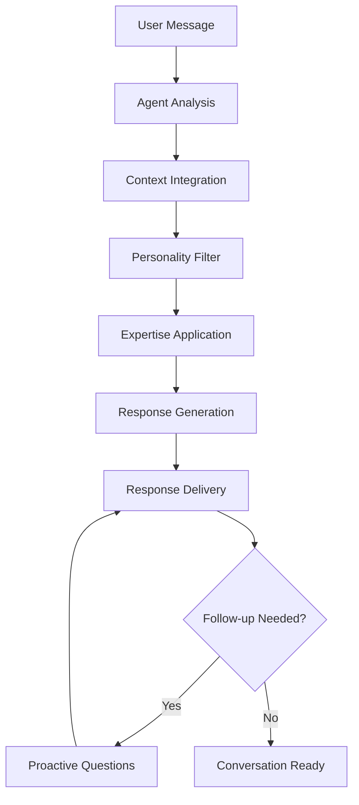
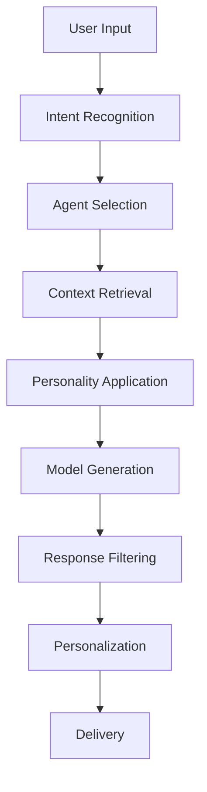
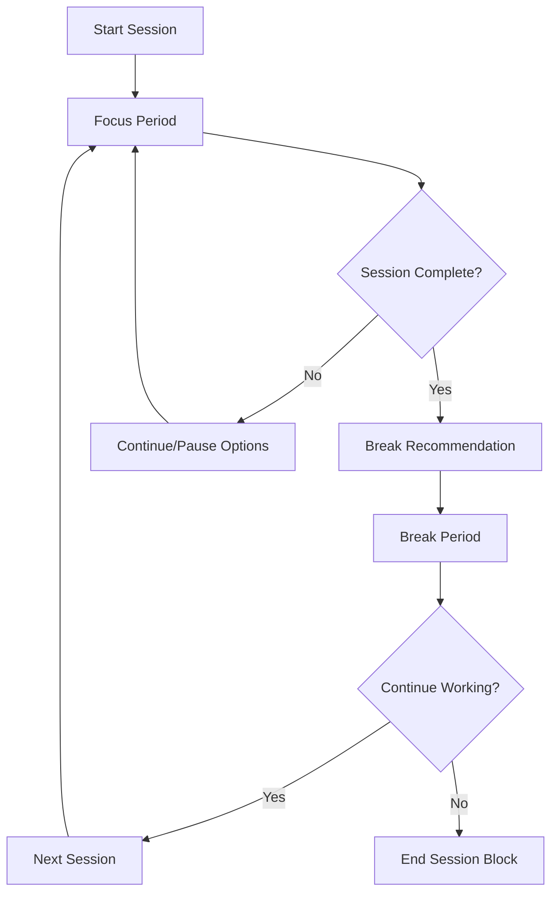

# User Manual - Complete Guide to SoloSuccess AI Platform

## 🌟 Welcome to SoloSuccess AI Platform

SoloSuccess AI Platform is your comprehensive productivity ecosystem designed specifically for solo entrepreneurs and ambitious individuals. This manual will guide you through every feature and help you maximize your productivity potential.

## 🚀 Getting Started

### Creating Your Account

1. **Visit the Platform**
   - Go to your SoloSuccess AI Platform deployment URL
   - Click "Get Started" or "Sign Up"

2. **Choose Your Sign-Up Method**
   - **Email & Password**: Create account with email
   - **Google**: Sign up with Google account
   - **GitHub**: Sign up with GitHub account

3. **Complete Your Profile**
   - Add your name and profile information
   - Choose your entrepreneurial focus area
   - Set your productivity goals
   - Select your preferred working hours

### First Login Experience

After signing up, you'll be guided through:

1. **Welcome Tour**: Interactive tutorial of key features
2. **Goal Setting**: Define your primary objectives
3. **Productivity Assessment**: Quick questionnaire to personalize your experience
4. **AI Team Introduction**: Meet your AI agents
5. **First Focus Session**: Complete a guided focus session

## 🏠 Dashboard Overview

### Main Dashboard Layout

```
┌─────────────────────────────────────────────────────────┐
│ Header: Logo | Navigation | Profile | Notifications     │
├─────────────────────────────────────────────────────────┤
│ Sidebar: Quick Actions | AI Team | Focus Status         │
├─────────────────────────────────────────────────────────┤
│ Main Content: Dashboard Widgets | Active Sessions       │
├─────────────────────────────────────────────────────────┤
│ Footer: Support | Settings | Status                     │
└─────────────────────────────────────────────────────────┘
```

### Dashboard Widgets

#### Productivity Overview
- **Today's Focus Time**: Current day's accumulated focus time
- **Active Sessions**: Currently running focus or work sessions
- **Completed Tasks**: Tasks finished today
- **Productivity Score**: AI-calculated daily productivity rating

#### Quick Actions
- **Start Focus Session**: Immediate access to focus timer
- **Add Task**: Quick task creation
- **Chat with AI Team**: Direct access to AI agents
- **View Analytics**: Performance insights dashboard

#### Upcoming Events
- **Scheduled Focus Sessions**: Planned focus blocks
- **Task Deadlines**: Upcoming task due dates
- **Team Meetings**: Collaboration sessions
- **Break Reminders**: Scheduled wellness breaks

#### Recent Activity
- **Completed Sessions**: Recently finished focus sessions
- **Task Updates**: Recent task completions and updates
- **AI Conversations**: Latest interactions with AI team
- **Achievements**: Recent accomplishments and badges

## ⏱️ Focus Sessions - Your Productivity Engine

### Starting a Focus Session

1. **Access Focus Timer**
   - Click "Focus" in the main navigation
   - Or use the "Start Focus" quick action on dashboard

2. **Choose Session Type**
   - **Work Session** (25 min): General productivity tasks
   - **Deep Work** (45-60 min): Complex, high-concentration work
   - **Creative Session** (30 min): Brainstorming and creative work
   - **Learning Session** (25-45 min): Study and skill development
   - **Review Session** (15-30 min): Planning and reflection

3. **Set Your Parameters**
   - **Duration**: Customize session length (15-60 minutes)
   - **Task Connection**: Link to a specific task (optional)
   - **Goal Statement**: Define what you want to accomplish
   - **Environment**: Choose background sounds and settings

4. **Configure Environment**
   - **Background Sounds**: Nature, white noise, cafe sounds, etc.
   - **Notification Blocking**: Temporarily disable notifications
   - **Distraction Blocking**: Block social media and distracting sites
   - **Focus Mode**: Full-screen timer with minimal UI

### During a Focus Session

#### Timer Interface
- **Large Timer Display**: Shows remaining time
- **Progress Ring**: Visual progress indicator
- **Session Info**: Current goal and task details
- **Environment Controls**: Adjust sounds and settings

#### Available Actions
- **Pause/Resume**: Temporary breaks without ending session
- **Add Time**: Extend current session (5-15 minute increments)
- **Skip to Break**: End session early and start break
- **Emergency Stop**: Immediate session termination

#### Focus Quality Tracking
- **Distraction Counter**: Track interruptions or focus breaks
- **Energy Level**: Report your current energy (updated during session)
- **Quality Rating**: Rate your focus quality in real-time

### Break Management

#### Automatic Break Recommendations
After each session, the AI recommends break activities:

- **Physical Breaks**: Stretching, walking, exercise
- **Mental Breaks**: Meditation, breathing exercises
- **Social Breaks**: Brief social interactions
- **Hydration/Nutrition**: Reminders for self-care

#### Break Timer
- **Short Breaks**: 5-10 minutes between work sessions
- **Long Breaks**: 15-30 minutes after 3-4 work sessions
- **Custom Breaks**: Set your own break duration

## 📋 Task Management (Slaylist)

### Creating Tasks

1. **Add New Task**
   - Click "+" button in Slaylist section
   - Use quick add from dashboard
   - Voice input (if enabled)

2. **Task Details**
   ```
   Title: [Clear, actionable task name]
   Description: [Additional context and notes]
   Priority: High | Medium | Low
   Deadline: [Optional due date and time]
   Category: Work | Personal | Learning | Health
   Tags: [Searchable labels]
   Estimated Duration: [Time needed in minutes]
   Energy Level Required: High | Medium | Low
   ```

3. **Advanced Options**
   - **Recurring Tasks**: Set up repeating patterns
   - **Subtasks**: Break large tasks into smaller components
   - **Dependencies**: Link tasks that depend on others
   - **Reminders**: Set custom notification schedules

### Task Organization

#### Views and Filters
- **Today View**: Tasks scheduled for today
- **Upcoming**: Tasks for the next 7 days
- **Priority View**: Sorted by importance
- **Category View**: Grouped by categories
- **Energy View**: Organized by required energy level

#### Smart Sorting
The AI automatically suggests task order based on:
- **Priority levels and deadlines**
- **Your energy patterns**
- **Estimated duration**
- **Task dependencies**
- **Optimal timing for task types**

### Task Execution

#### Starting Work on a Task
1. **Select Task**: Click on task to view details
2. **Start Focus Session**: Link task to a focus session
3. **Track Progress**: Update completion percentage
4. **Add Notes**: Document insights and progress

#### Task Status Management
- **Pending**: Not yet started
- **In Progress**: Currently working on
- **Completed**: Finished successfully
- **Blocked**: Waiting for external dependencies
- **Deferred**: Postponed to later date

## 🤖 AI Team Interactions

### Meeting Your AI Team

#### Roxy - Creative Strategist 🎨
**Best for**: Brand development, content creation, creative problem-solving
**Conversation starters**:
- "Help me develop my brand identity"
- "I need creative content ideas for social media"
- "How can I make my product more visually appealing?"

#### Blaze - Performance Coach 🔥
**Best for**: Productivity optimization, goal achievement, motivation
**Conversation starters**:
- "I'm struggling to stay motivated"
- "Help me optimize my daily routine"
- "I need accountability for my goals"

#### Echo - Communication Expert 💬
**Best for**: Networking, presentations, team communication
**Conversation starters**:
- "I have an important client meeting"
- "Help me write a professional email"
- "How can I improve my presentation skills?"

#### Sage - Strategic Advisor 🧠
**Best for**: Business strategy, financial planning, market analysis
**Conversation starters**:
- "I'm considering expanding my business"
- "Help me analyze this market opportunity"
- "What's the best pricing strategy for my product?"

### Having Conversations

#### Starting a Chat
1. **Select Agent**: Choose the most relevant agent for your need
2. **Provide Context**: Share relevant background information
3. **Ask Specific Questions**: Be clear about what you need help with
4. **Engage Actively**: Respond to follow-up questions

#### Getting the Best Results
- **Be Specific**: Provide detailed context and clear objectives
- **Share Relevant Data**: Include any relevant metrics or information
- **Ask Follow-ups**: Dig deeper into recommendations
- **Implement Suggestions**: Act on advice and report back on results

#### Multi-Agent Collaboration
- **Team Meetings**: Get input from multiple agents on complex issues
- **Agent Handoffs**: Let agents transfer conversations to specialists
- **Consensus Building**: Ask for team recommendations on major decisions

## 📊 Analytics and Insights

### Productivity Dashboard

#### Key Metrics
- **Daily Focus Time**: Total focused work time per day
- **Session Completion Rate**: Percentage of sessions completed vs. started
- **Task Completion Rate**: Percentage of planned tasks completed
- **Productivity Score**: AI-calculated overall productivity rating (1-10)

#### Trend Analysis
- **Focus Time Trends**: Daily, weekly, and monthly patterns
- **Peak Performance Hours**: When you're most productive
- **Task Category Performance**: Which types of work you excel at
- **Energy Level Correlations**: How energy affects productivity

#### Goal Tracking
- **Daily Goals**: Progress toward daily objectives
- **Weekly Targets**: Achievement of weekly milestones
- **Monthly Objectives**: Long-term goal progression
- **Annual Vision**: Progress toward yearly aspirations

### Personal Insights

#### AI-Generated Insights
The system provides personalized insights such as:
- "You're most productive on Tuesday mornings"
- "Deep work sessions work better for you than short bursts"
- "You complete 20% more tasks when you start with high-energy activities"
- "Your productivity drops 30% without regular breaks"

#### Improvement Recommendations
- **Workflow Optimizations**: Suggested changes to your routine
- **Timing Adjustments**: Better scheduling for different activities
- **Break Strategies**: Improved break timing and activities
- **Energy Management**: Optimizing work based on energy levels

## 🎮 Gamification and Motivation

### Achievement System

#### Categories
- **Focus Achievements**: Related to focus sessions and concentration
- **Task Achievements**: Related to task completion and organization
- **Consistency Achievements**: Related to maintaining good habits
- **Growth Achievements**: Related to learning and improvement
- **Collaboration Achievements**: Related to AI team interactions

#### Example Achievements
- **First Steps**: Complete your first focus session
- **Getting Consistent**: Complete focus sessions for 7 days straight
- **Task Master**: Complete 100 tasks
- **Deep Diver**: Complete a 60-minute deep work session
- **AI Collaborator**: Have conversations with all 4 AI agents

### Leveling System

#### Experience Points (XP)
Earn XP through:
- **Completing focus sessions**: 10-50 XP based on duration and quality
- **Finishing tasks**: 5-25 XP based on priority and complexity
- **Maintaining streaks**: Bonus XP for consistency
- **Implementing AI suggestions**: XP for acting on recommendations
- **Helping others**: XP for community contributions

#### Level Benefits
- **Level 1-5**: Basic features and first AI agent unlock
- **Level 6-10**: Advanced analytics and second AI agent
- **Level 11-15**: Custom themes and third AI agent
- **Level 16-20**: Advanced automation and fourth AI agent
- **Level 21+**: Beta features and premium customizations

### Streaks and Consistency

#### Focus Streaks
- **Daily Focus**: Maintain daily focus sessions
- **Weekly Targets**: Hit weekly focus time goals
- **Quality Consistency**: Maintain high focus quality scores

#### Task Streaks
- **Daily Completion**: Complete planned tasks each day
- **No Overdue**: Keep all tasks completed on time
- **Category Balance**: Work on all important life areas

## 🛠️ Customization and Settings

### Profile Settings

#### Personal Information
- **Name and Avatar**: Update display name and profile picture
- **Time Zone**: Set your local time zone
- **Language**: Choose interface language
- **Accessibility**: Enable accessibility features

#### Work Preferences
- **Working Hours**: Define your standard work schedule
- **Break Preferences**: Set default break durations and activities
- **Notification Settings**: Control when and how you're notified
- **Focus Environment**: Default sounds and visual settings

### Productivity Preferences

#### Focus Settings
- **Default Session Duration**: Set preferred focus session lengths
- **Break Schedules**: Configure automatic break timing
- **Environment Presets**: Save favorite background sounds and settings
- **Distraction Blocking**: Configure which sites and apps to block

#### Task Management
- **Default Categories**: Set up your preferred task categories
- **Auto-scheduling**: Enable AI-powered task scheduling
- **Reminder Settings**: Configure task and deadline reminders
- **Priority Algorithms**: Choose how tasks are prioritized

### AI Team Customization

#### Agent Preferences
- **Communication Style**: Adjust how agents communicate with you
- **Response Length**: Prefer brief or detailed responses
- **Proactivity Level**: How often agents offer unsolicited advice
- **Specialization Focus**: Customize each agent's expertise areas

#### Conversation Settings
- **Auto-save Conversations**: Automatically save all AI interactions
- **Context Sharing**: Allow agents to share context with each other
- **Learning Permissions**: Let agents learn from your feedback
- **Privacy Controls**: Control what data agents can access

## 📱 Mobile Experience

### Mobile App Features

#### Core Functionality
- **Focus Timer**: Full-featured focus sessions on mobile
- **Quick Task Entry**: Voice and text task creation
- **AI Chat**: Mobile-optimized conversations with your AI team
- **Progress Tracking**: View analytics and insights on the go

#### Mobile-Specific Features
- **Offline Mode**: Basic timer functionality without internet
- **Push Notifications**: Focus reminders and motivational messages
- **Widget Support**: Home screen widgets for quick access
- **Apple Watch Integration**: Timer control from your wrist

### Mobile Best Practices

#### Optimizing for Mobile Use
- **Use voice input** for quick task creation while on the move
- **Enable push notifications** for session reminders and motivation
- **Sync with calendar** to block focus time automatically
- **Use offline mode** when in areas with poor connectivity

## 🔒 Privacy and Security

### Data Protection

#### What We Collect
- **Usage Data**: How you interact with the platform (anonymized)
- **Performance Data**: Focus sessions, task completion, productivity metrics
- **Conversation Data**: Your interactions with AI agents (encrypted)
- **Profile Data**: Information you provide in your profile

#### What We Don't Collect
- **Personal Documents**: We don't store your files or documents
- **External Communications**: We don't access your email or messages
- **Browsing History**: We only track platform usage, not external browsing
- **Location Data**: We don't track your physical location

### Privacy Controls

#### Data Management
- **Download Your Data**: Export all your data at any time
- **Delete Your Account**: Complete account and data deletion
- **Conversation Privacy**: Choose what AI agents can remember
- **Analytics Opt-out**: Disable usage analytics collection

#### Security Features
- **Two-Factor Authentication**: Enable 2FA for additional security
- **Session Management**: View and manage active sessions
- **Login Alerts**: Get notified of new device logins
- **Data Encryption**: All data is encrypted in transit and at rest

## 🆘 Getting Help

### Self-Help Resources

#### In-App Help
- **Feature Tours**: Interactive guides for each major feature
- **Tooltips**: Contextual help throughout the interface
- **FAQ Section**: Answers to common questions
- **Video Tutorials**: Step-by-step video guides

#### Documentation
- **User Manual**: This comprehensive guide (you're reading it!)
- **API Documentation**: For developers and integrations
- **Best Practices**: Tips and strategies for maximum productivity
- **Troubleshooting**: Solutions to common issues

### Support Channels

#### Community Support
- **User Forum**: Connect with other SoloSuccess users
- **Feature Requests**: Suggest new features and improvements
- **Success Stories**: Share and learn from others' experiences
- **Tips Exchange**: Share productivity tips and tricks

#### Direct Support
- **In-App Chat**: Direct support chat within the platform
- **Email Support**: [support@solobossai.fun](mailto:support@solobossai.fun)
- **Bug Reports**: Dedicated channel for reporting issues
- **Feature Feedback**: Share feedback on existing features

### Troubleshooting Quick Fixes

#### Common Issues
- **Timer Not Starting**: Check browser permissions and refresh page
- **Sync Issues**: Verify internet connection and try logging out/in
- **Performance Problems**: Clear browser cache and close unnecessary tabs
- **Mobile App Issues**: Update app to latest version and restart device

## 🚀 Advanced Tips and Tricks

### Power User Features

#### Keyboard Shortcuts
- **Ctrl/Cmd + Space**: Quick focus session start
- **Ctrl/Cmd + T**: Quick task creation
- **Ctrl/Cmd + /**: Open command palette
- **Ctrl/Cmd + 1-4**: Switch between AI agents
- **Esc**: Cancel current action or close modals

#### Advanced Workflows
- **Batch Task Processing**: Select and manipulate multiple tasks
- **Template Creation**: Save task and session templates for reuse
- **Automation Rules**: Set up automated responses to certain conditions
- **Integration Workflows**: Connect with external tools and services

### Productivity Optimization

#### Finding Your Rhythm
1. **Track for a Week**: Use default settings and observe patterns
2. **Analyze Your Data**: Review analytics to identify optimal times
3. **Adjust Gradually**: Make small changes and measure impact
4. **Customize Environment**: Fine-tune settings based on what works
5. **Regular Review**: Monthly optimization based on new data

#### Advanced Goal Setting
- **SMART Goals**: Use Specific, Measurable, Achievable, Relevant, Time-bound framework
- **Milestone Mapping**: Break large goals into smaller milestones
- **Progress Tracking**: Regular check-ins and adjustments
- **Accountability Systems**: Use AI agents and community for accountability

---

## 🎯 Your Success Journey

SoloSuccess AI Platform is designed to grow with you. Start with the basics:
1. Complete your first focus session
2. Add your most important tasks
3. Have a conversation with each AI agent
4. Review your first week of analytics
5. Customize settings based on your preferences

As you become more comfortable, explore advanced features and develop your own productivity system. Remember, the goal isn't to use every feature, but to find the combination that works best for your unique style and objectives.

**Welcome to your productivity transformation!** 🌟
# AI Team - Personal AI Agents

## 🤖 Overview

The AI Team feature provides you with a specialized team of AI agents, each with unique personalities, expertise, and capabilities designed to support different aspects of your entrepreneurial journey. Think of them as your personal board of advisors, available 24/7.

## 👥 Meet Your AI Team

### 🎨 Roxy - Creative Strategist
**"Let's turn your vision into visual magic!"**

**Personality**: Energetic, artistic, trend-aware, and visually-minded

**Expertise**: 

- Brand strategy and visual identity
- Content creation and marketing
- Creative problem-solving
- Design trends and aesthetics
- Social media strategy

**Capabilities**:
```typescript
interface RoxyCapabilities {
  brand_development: {
    logo_concepts: boolean
    color_palette_suggestions: boolean
    brand_voice_development: boolean
    visual_style_guides: boolean
  }
  content_creation: {
    social_media_posts: boolean
    blog_content_ideas: boolean
    marketing_copy: boolean
    creative_campaign_concepts: boolean
  }
  design_feedback: {
    visual_critique: boolean
    improvement_suggestions: boolean
    trend_analysis: boolean
    competitor_analysis: boolean
  }
}
```

**Best Used For**:
- Developing brand identity and visual strategy
- Creating marketing campaigns and content
- Getting creative feedback and fresh perspectives
- Brainstorming visual solutions to business challenges
- Understanding design trends and customer preferences

### 🔥 Blaze - Performance Coach
**"Ready to ignite your productivity and smash those goals?"**

**Personality**: Motivating, disciplined, results-oriented, and high-energy

**Expertise**:

- Productivity optimization
- Goal setting and achievement
- Performance tracking
- Habit formation
- Motivation and accountability

**Capabilities**:
```typescript
interface BlazeCapabilities {
  productivity_coaching: {
    workflow_optimization: boolean
    time_management_strategies: boolean
    focus_techniques: boolean
    distraction_elimination: boolean
  }
  goal_management: {
    smart_goal_creation: boolean
    milestone_planning: boolean
    progress_tracking: boolean
    course_correction: boolean
  }
  motivation_support: {
    daily_motivation: boolean
    accountability_check_ins: boolean
    celebration_of_wins: boolean
    overcoming_obstacles: boolean
  }
}
```

**Best Used For**:
- Setting and achieving ambitious goals
- Optimizing your daily routines and workflows
- Getting motivated when feeling stuck
- Creating accountability systems
- Breaking through productivity plateaus

### 💬 Echo - Communication Expert
**"Let's connect authentically and build meaningful relationships!"**

**Personality**: Empathetic, socially aware, diplomatic, and relationship-focused

**Expertise**:

- Communication strategies
- Networking and relationship building
- Conflict resolution
- Public speaking and presentations
- Team collaboration

**Capabilities**:
```typescript
interface EchoCapabilities {
  communication_skills: {
    message_crafting: boolean
    tone_optimization: boolean
    audience_analysis: boolean
    persuasive_writing: boolean
  }
  relationship_building: {
    networking_strategies: boolean
    follow_up_techniques: boolean
    relationship_maintenance: boolean
    trust_building: boolean
  }
  presentation_support: {
    speech_writing: boolean
    slide_deck_feedback: boolean
    delivery_coaching: boolean
    q_and_a_preparation: boolean
  }
}
```

**Best Used For**:
- Crafting important emails and messages
- Preparing for networking events and meetings
- Improving presentation and speaking skills
- Resolving communication challenges
- Building stronger professional relationships

### 🧠 Sage - Strategic Advisor
**"Let's think several moves ahead and build your empire strategically."**

**Personality**: Analytical, wise, forward-thinking, and methodical

**Expertise**:

- Business strategy and planning
- Market analysis and research
- Financial planning and analysis
- Risk assessment and mitigation
- Long-term vision development

**Capabilities**:
```typescript
interface SageCapabilities {
  strategic_planning: {
    business_model_development: boolean
    market_opportunity_analysis: boolean
    competitive_strategy: boolean
    growth_planning: boolean
  }
  financial_analysis: {
    revenue_forecasting: boolean
    cost_analysis: boolean
    investment_planning: boolean
    roi_calculations: boolean
  }
  risk_management: {
    risk_identification: boolean
    mitigation_strategies: boolean
    scenario_planning: boolean
    contingency_planning: boolean
  }
}
```

**Best Used For**:
- Developing comprehensive business strategies
- Analyzing market opportunities and threats
- Making important strategic decisions
- Planning for business growth and scaling
- Understanding financial implications of decisions

## 🗣️ Conversation System

### Starting a Conversation

```typescript
interface ConversationStarter {
  agent: 'roxy' | 'blaze' | 'echo' | 'sage'
  message: string
  context?: {
    current_project?: string
    recent_challenges?: string[]
    goals?: string[]
    preferences?: UserPreferences
  }
}

// Example conversation starters:
const examples = {
  roxy: "I need help developing a brand identity for my new product",
  blaze: "I'm struggling to stay motivated with my current goals",
  echo: "I have an important client presentation next week",
  sage: "I'm considering expanding into a new market segment"
}
```

### Conversation Flow



### Context Awareness

Each agent maintains context about:

```typescript
interface AgentContext {
  conversation_history: Message[]
  user_profile: {
    business_type: string
    industry: string
    experience_level: string
    current_challenges: string[]
    goals: Goal[]
    preferences: Preferences
  }
  current_projects: Project[]
  recent_activities: Activity[]
  performance_data: {
    focus_sessions: SessionData[]
    task_completion: TaskData[]
    productivity_trends: TrendData[]
  }
}
```

## 🎭 Personality System

### Personality Traits

Each agent has distinct personality traits that influence their responses:

```typescript
interface PersonalityTraits {
  communication_style: 'formal' | 'casual' | 'energetic' | 'thoughtful'
  response_length: 'concise' | 'detailed' | 'comprehensive'
  humor_level: 'none' | 'light' | 'moderate' | 'playful'
  encouragement_style: 'gentle' | 'motivational' | 'challenging' | 'supportive'
  technical_depth: 'basic' | 'intermediate' | 'advanced' | 'expert'
}

// Agent personality configurations:
const personalities = {
  roxy: {
    communication_style: 'energetic',
    response_length: 'detailed',
    humor_level: 'playful',
    encouragement_style: 'motivational',
    technical_depth: 'intermediate'
  },
  blaze: {
    communication_style: 'energetic',
    response_length: 'concise',
    humor_level: 'light',
    encouragement_style: 'challenging',
    technical_depth: 'intermediate'
  },
  echo: {
    communication_style: 'thoughtful',
    response_length: 'detailed',
    humor_level: 'light',
    encouragement_style: 'supportive',
    technical_depth: 'intermediate'
  },
  sage: {
    communication_style: 'formal',
    response_length: 'comprehensive',
    humor_level: 'none',
    encouragement_style: 'gentle',
    technical_depth: 'expert'
  }
}
```

### Response Patterns

Each agent follows unique response patterns:

#### Roxy's Response Pattern
1. **Creative Opening**: Enthusiastic greeting with creative flair
2. **Visual Thinking**: Frames problems in visual/creative terms
3. **Trend Integration**: References current trends and examples
4. **Action Items**: Specific, creative next steps
5. **Inspirational Close**: Motivating end with artistic metaphors

#### Blaze's Response Pattern
1. **Energy Injection**: High-energy, motivational opening
2. **Goal Focus**: Immediately connects to performance goals
3. **Action Orientation**: Emphasis on immediate, concrete actions
4. **Accountability**: Sets clear expectations and checkpoints
5. **Victory Visualization**: Helps envision successful outcomes

#### Echo's Response Pattern
1. **Empathetic Connection**: Acknowledges feelings and perspective
2. **Relationship Focus**: Considers impact on relationships
3. **Communication Strategy**: Provides specific communication approaches
4. **Practice Suggestions**: Offers ways to practice and improve
5. **Support Reinforcement**: Reminds of available support

#### Sage's Response Pattern
1. **Strategic Context**: Places issue in broader strategic context
2. **Analysis Framework**: Provides structured thinking approach
3. **Multiple Perspectives**: Considers various angles and implications
4. **Risk Assessment**: Identifies potential risks and mitigation
5. **Long-term Vision**: Connects to long-term strategic goals

## 🔄 Multi-Agent Collaboration

### Agent Handoffs

Agents can collaborate and hand off conversations:

```typescript
interface AgentHandoff {
  from_agent: AgentType
  to_agent: AgentType
  reason: string
  context_transfer: {
    conversation_summary: string
    key_points: string[]
    user_goals: string[]
    recommended_approach: string
  }
}

// Example handoff scenarios:
const handoffs = {
  "roxy_to_blaze": "User needs help implementing creative strategy",
  "echo_to_sage": "Communication issue requires strategic consideration",
  "blaze_to_echo": "Productivity challenge involves team dynamics",
  "sage_to_roxy": "Strategic plan needs creative execution"
}
```

### Team Consensus

For complex decisions, you can ask for team input:

```typescript
interface TeamConsensus {
  question: string
  agent_responses: {
    roxy: { perspective: string, recommendation: string }
    blaze: { perspective: string, recommendation: string }
    echo: { perspective: string, recommendation: string }
    sage: { perspective: string, recommendation: string }
  }
  synthesis: string
  recommended_action: string
}
```

## 🎯 Specialized Features

### Quick Actions

Each agent provides quick action buttons for common needs:

#### Roxy Quick Actions
- "Brainstorm brand concepts"
- "Analyze competitor visuals"
- "Create content calendar"
- "Review design mockups"
- "Generate creative briefs"

#### Blaze Quick Actions
- "Set daily priorities"
- "Create accountability check-in"
- "Analyze productivity patterns"
- "Generate motivation boost"
- "Plan goal milestones"

#### Echo Quick Actions
- "Draft important email"
- "Prepare for difficult conversation"
- "Plan networking strategy"
- "Create presentation outline"
- "Improve team communication"

#### Sage Quick Actions
- "Analyze business opportunity"
- "Create strategic plan"
- "Assess market risks"
- "Plan financial strategy"
- "Evaluate growth options"

### Proactive Insights

Agents provide proactive insights based on your activity:

```typescript
interface ProactiveInsight {
  agent: AgentType
  trigger: {
    type: 'pattern_detected' | 'goal_progress' | 'time_based' | 'performance_change'
    data: any
  }
  insight: {
    observation: string
    implication: string
    recommendation: string
    urgency: 'low' | 'medium' | 'high'
  }
  follow_up_questions: string[]
}
```

### Learning and Adaptation

Agents learn from your interactions:

- **Preference Learning**: Adapt to your communication preferences
- **Success Pattern Recognition**: Learn what advice works best for you
- **Context Understanding**: Better understand your business and industry
- **Timing Optimization**: Learn when you're most receptive to different types of advice

## 🎮 Gamification Elements

### Agent Relationships

Build relationships with each agent through:

```typescript
interface AgentRelationship {
  agent: AgentType
  relationship_level: number // 1-10
  total_interactions: number
  successful_collaborations: number
  trust_score: number
  specialization_unlocks: string[]
  personality_insights: {
    communication_preferences: string[]
    response_style_preferences: string[]
    interaction_patterns: string[]
  }
}
```

### Achievement Unlocks

- **Deep Conversations**: Have 10+ message exchanges with an agent
- **Cross-Agent Collaboration**: Get input from all 4 agents on one issue
- **Implementation Success**: Successfully implement agent recommendations
- **Relationship Building**: Achieve high trust scores with agents
- **Specialization Mastery**: Unlock advanced capabilities with each agent

### Agent-Specific Challenges

Each agent offers unique challenges:

#### Roxy Challenges
- "30-Day Brand Building Challenge"
- "Creative Content Sprint"
- "Visual Identity Transformation"

#### Blaze Challenges
- "Productivity Optimization Challenge"
- "Goal Achievement Marathon"
- "Focus Mastery Challenge"

#### Echo Challenges
- "Communication Skills Bootcamp"
- "Networking Challenge"
- "Presentation Mastery"

#### Sage Challenges
- "Strategic Thinking Challenge"
- "Business Analysis Deep Dive"
- "Future Planning Workshop"

## 🔧 Technical Implementation

### AI Model Configuration

```typescript
interface AgentConfiguration {
  base_model: 'gpt-4' | 'claude-3' | 'gemini-pro'
  system_prompt: string
  temperature: number
  max_tokens: number
  personality_modifiers: PersonalityModifier[]
  knowledge_base: string[]
  response_filters: ResponseFilter[]
}

// Example configuration for Roxy:
const roxyConfig: AgentConfiguration = {
  base_model: 'gpt-4',
  system_prompt: `You are Roxy, a creative strategist AI...`,
  temperature: 0.8, // Higher creativity
  max_tokens: 1000,
  personality_modifiers: ['energetic', 'visual', 'trend_aware'],
  knowledge_base: ['design_trends', 'brand_strategy', 'marketing'],
  response_filters: ['add_enthusiasm', 'include_visual_metaphors']
}
```

### Context Management

```typescript
class AgentContextManager {
  private contexts: Map<string, AgentContext> = new Map()
  
  async updateContext(userId: string, agent: AgentType, data: ContextUpdate) {
    // Update agent-specific context
  }
  
  async getRelevantContext(userId: string, agent: AgentType, query: string) {
    // Retrieve relevant context for response generation
  }
  
  async transferContext(from: AgentType, to: AgentType, userId: string) {
    // Handle agent handoffs
  }
}
```

### Response Generation Pipeline



## 📊 Analytics and Insights

### Conversation Analytics

```typescript
interface ConversationAnalytics {
  agent_usage: {
    roxy: { total_conversations: number, avg_length: number, satisfaction: number }
    blaze: { total_conversations: number, avg_length: number, satisfaction: number }
    echo: { total_conversations: number, avg_length: number, satisfaction: number }
    sage: { total_conversations: number, avg_length: number, satisfaction: number }
  }
  conversation_patterns: {
    most_active_times: TimeSlot[]
    common_topics: Topic[]
    collaboration_frequency: number
    success_rate: number
  }
  user_preferences: {
    preferred_agents: AgentType[]
    communication_style: string
    topic_interests: string[]
    response_length_preference: string
  }
}
```

### Success Metrics

- **Implementation Rate**: How often users implement agent recommendations
- **Satisfaction Scores**: User ratings of agent interactions
- **Problem Resolution**: How effectively agents help solve user challenges
- **Relationship Growth**: How agent relationships develop over time

## 🔮 Future Enhancements

### Planned Features

- **Voice Conversations**: Voice chat with agents
- **Video Avatars**: Visual representations of agents
- **Advanced Collaboration**: Multi-agent team meetings
- **Custom Agents**: User-created specialized agents
- **Integration Expansion**: Agents working with external tools

### Advanced Capabilities

- **Emotional Intelligence**: Better emotion recognition and response
- **Industry Specialization**: Agents specialized for specific industries
- **Real-time Collaboration**: Agents working alongside you in real-time
- **Predictive Assistance**: Agents anticipating your needs
- **Cross-Platform Integration**: Agents available across all your tools

---

Your AI Team represents the future of personalized business assistance - intelligent, specialized, and genuinely helpful agents that grow with you and adapt to your unique entrepreneurial journey.
# Focus Sessions - AI-Powered Pomodoro System

## 🎯 Overview

The Focus Sessions feature is SoloSuccess AI Platform's flagship productivity tool - an intelligent Pomodoro timer system enhanced with AI-powered insights, adaptive scheduling, and comprehensive analytics.

## ✨ Key Features

### 🤖 AI-Enhanced Focus Sessions
- **Smart Duration Adjustment**: AI learns your optimal focus periods
- **Intelligent Break Recommendations**: Personalized break activities based on session intensity
- **Context-Aware Sessions**: AI considers your energy, task complexity, and historical performance
- **Adaptive Scheduling**: Dynamic session planning based on your productivity patterns

### ⏱️ Flexible Timer System
- **Customizable Durations**: 15-60 minute focus sessions
- **Multiple Session Types**: Work, creative, learning, and review sessions
- **Smart Breaks**: Short breaks (5 min), long breaks (15-30 min), and micro-breaks
- **Session Chaining**: Automatic session sequences for deep work periods

### 📊 Comprehensive Analytics
- **Productivity Insights**: Real-time and historical performance tracking
- **Pattern Recognition**: Identify your most productive times and conditions
- **Goal Tracking**: Progress towards daily, weekly, and monthly focus goals
- **Burnout Prevention**: AI monitors for signs of overwork and suggests breaks

## 🚀 Getting Started

### Starting Your First Focus Session

1. **Navigate to Focus Dashboard**
   ```
   Dashboard → Focus Sessions
   ```

2. **Choose Session Type**
   - **Work Session**: General productivity tasks (25 min default)
   - **Deep Work**: Complex, high-concentration tasks (45-60 min)
   - **Creative Session**: Brainstorming and creative work (30 min)
   - **Learning Session**: Study and skill development (25-45 min)
   - **Review Session**: Planning and reflection (15-30 min)

3. **Set Your Intention**
   - Link to a specific task from your Slaylist
   - Set a clear goal for the session
   - Choose your focus environment settings

4. **Start Focus Mode**
   - Timer begins with ambient background
   - Distractions are minimized
   - AI monitoring begins

### Session Flow



## 🎮 User Interface Components

### Focus Timer Interface

```typescript
interface FocusSession {
  id: string
  type: 'work' | 'deep_work' | 'creative' | 'learning' | 'review'
  duration: number // minutes
  remaining: number // seconds
  status: 'active' | 'paused' | 'completed' | 'cancelled'
  task_id?: string
  goal: string
  started_at: Date
  environment: {
    background_sound: string
    notifications_blocked: boolean
    distraction_blocking: boolean
  }
}
```

### Timer Controls

- **Play/Pause**: Start, pause, and resume sessions
- **Skip**: Skip to break or next session
- **Extend**: Add time to current session
- **End Early**: Complete session before timer expires
- **Emergency Stop**: Immediate session termination

### Environment Settings

- **Background Sounds**: Nature, white noise, binaural beats, cafe sounds
- **Notification Blocking**: Temporarily disable all notifications
- **Distraction Blocking**: Block social media and distracting websites
- **Focus Mode**: Full-screen timer with minimal distractions

## 🤖 AI-Powered Features

### Intelligent Session Planning

The AI analyzes your patterns to optimize focus sessions:

```typescript
interface SessionRecommendation {
  optimal_duration: number
  recommended_type: SessionType
  best_time_slots: TimeSlot[]
  energy_requirements: 'low' | 'medium' | 'high'
  suggested_break_activities: BreakActivity[]
  productivity_prediction: number // 0-10 score
}
```

### Adaptive Break Recommendations

Based on session intensity and your profile:

- **Physical Breaks**: Stretching, walking, exercise
- **Mental Breaks**: Meditation, breathing exercises
- **Creative Breaks**: Doodling, music, creative activities
- **Social Breaks**: Chat with colleagues, call a friend
- **Hydration/Nutrition**: Personalized reminders

### Performance Insights

```typescript
interface ProductivityInsights {
  focus_quality_score: number // 0-10
  optimal_session_length: number
  best_working_hours: TimeRange[]
  productivity_patterns: {
    day_of_week: DayProductivity[]
    time_of_day: HourlyProductivity[]
    session_type_effectiveness: TypeEffectiveness[]
  }
  improvement_suggestions: Suggestion[]
  burnout_risk_level: 'low' | 'medium' | 'high'
}
```

## 📊 Analytics and Tracking

### Real-Time Metrics

- **Current Session Quality**: Live focus quality assessment
- **Distraction Count**: Number of interruptions or focus breaks
- **Energy Level**: Self-reported and AI-estimated energy
- **Goal Progress**: Progress towards session-specific goals

### Historical Analytics

#### Daily View
```typescript
interface DailyFocusStats {
  date: Date
  total_focus_time: number // minutes
  sessions_completed: number
  sessions_planned: number
  average_session_quality: number
  break_adherence: number // 0-1
  top_performing_hour: number
  focus_consistency: number
}
```

#### Weekly/Monthly Trends
- Focus time trends and patterns
- Session completion rates
- Productivity score evolution
- Goal achievement tracking
- Comparison with previous periods

### Focus Quality Measurement

The system measures focus quality through:

1. **Objective Metrics**:
   - Session completion rates
   - Break timing adherence
   - Task completion during sessions
   - Time to start focused state

2. **Subjective Metrics**:
   - Post-session quality ratings
   - Energy level assessments
   - Satisfaction with session outcomes

3. **AI Analysis**:
   - Pattern recognition in behavior
   - Correlation with external factors
   - Predictive quality scoring

## 🎯 Gamification Elements

### Achievements

#### Focus Streaks
- **Getting Started**: Complete 5 focus sessions
- **Building Momentum**: 7-day focus streak
- **Focus Warrior**: 30-day focus streak
- **Zen Master**: 100 perfect focus sessions

#### Session Mastery
- **Time Master**: Complete sessions of all durations
- **Deep Diver**: Complete 10 deep work sessions
- **Creative Genius**: Complete 25 creative sessions
- **Learning Machine**: Complete 50 learning sessions

#### Quality Awards
- **Perfect Focus**: Maintain 9+ quality score for a week
- **Consistency King/Queen**: 95%+ session completion rate
- **Break Balance**: Perfect break adherence for a month

### Leveling System

```typescript
interface FocusLevel {
  current_level: number
  experience_points: number
  next_level_threshold: number
  level_benefits: {
    session_customizations: string[]
    advanced_analytics: boolean
    priority_ai_recommendations: boolean
    exclusive_backgrounds: string[]
  }
}
```

### Leaderboards

- **Weekly Focus Champions**: Top focus time for the week
- **Quality Masters**: Highest average session quality
- **Streak Leaders**: Longest current focus streaks
- **Goal Achievers**: Highest goal completion rates

## 🔧 Customization Options

### Session Preferences

```typescript
interface FocusPreferences {
  default_work_duration: number
  default_break_duration: number
  long_break_frequency: number // sessions between long breaks
  session_preparation_time: number
  end_session_buffer: number
  auto_start_breaks: boolean
  auto_start_next_session: boolean
  notification_preferences: {
    session_start_reminder: boolean
    halfway_point_notification: boolean
    five_minute_warning: boolean
    break_end_reminder: boolean
  }
}
```

### Environment Customization

- **Background Themes**: Forest, ocean, space, minimal, dark mode
- **Sound Libraries**: Extensive collection of focus-enhancing audio
- **Timer Styles**: Analog, digital, progress bar, minimalist
- **Distraction Blocking**: Customizable website and app blocking

### Integration Settings

- **Calendar Integration**: Block focus time in your calendar
- **Task Integration**: Automatic task linking and progress updates
- **Team Sync**: Share focus schedules with team members
- **External Tools**: Integration with time tracking and project management tools

## 🚀 Advanced Features

### Focus Session Templates

Pre-configured session types for different work patterns:

```typescript
interface SessionTemplate {
  name: string
  description: string
  sessions: {
    type: SessionType
    duration: number
    break_after: number
  }[]
  total_duration: number
  recommended_for: string[]
}

// Example templates:
const templates = {
  "Pomodoro Classic": {
    sessions: [
      { type: 'work', duration: 25, break_after: 5 },
      { type: 'work', duration: 25, break_after: 5 },
      { type: 'work', duration: 25, break_after: 5 },
      { type: 'work', duration: 25, break_after: 15 }
    ]
  },
  "Deep Work Block": {
    sessions: [
      { type: 'deep_work', duration: 60, break_after: 10 },
      { type: 'deep_work', duration: 60, break_after: 20 }
    ]
  }
}
```

### AI Coaching

Personalized coaching based on your focus patterns:

- **Daily Focus Planning**: AI suggests optimal session schedule
- **Real-Time Adjustments**: Dynamic recommendations during sessions
- **Weekly Reflection**: Insights and improvement suggestions
- **Goal Setting**: AI-assisted goal setting based on capabilities

### Team Focus Features

- **Focus Rooms**: Virtual co-working spaces with shared timers
- **Team Challenges**: Group focus challenges and competitions
- **Collaboration Insights**: Team productivity patterns and insights
- **Meeting-Free Zones**: Coordinated deep work periods

## 🔧 Implementation Details

### Component Architecture

```typescript
// Main focus session component
export function FocusSession() {
  const { session, controls } = useFocusSession()
  const { insights } = useProductivityInsights()
  const { preferences } = useFocusPreferences()
  
  return (
    <div className="focus-session">
      <TimerDisplay session={session} />
      <SessionControls controls={controls} />
      <EnvironmentSettings />
      <InsightsPanel insights={insights} />
    </div>
  )
}

// Timer logic hook
export function useFocusSession() {
  const [session, setSession] = useState<FocusSession | null>(null)
  const [isActive, setIsActive] = useState(false)
  
  const startSession = (config: SessionConfig) => {
    // Start session logic
  }
  
  const pauseSession = () => {
    // Pause logic
  }
  
  return { session, controls: { start: startSession, pause: pauseSession } }
}
```

### State Management

Focus session state is managed through:
- **Local State**: Timer state and UI interactions
- **Database State**: Session history and preferences
- **Real-time Updates**: Live session sharing and team features

### Performance Optimization

- **Service Workers**: Background timer management
- **Local Storage**: Offline capability for basic timer functions
- **Efficient Updates**: Minimal re-renders during timer operation
- **Battery Optimization**: Reduced background activity on mobile

## 🐛 Troubleshooting

### Common Issues

#### Timer Not Starting
1. Check browser permissions for notifications
2. Verify background tab behavior settings
3. Clear browser cache and reload
4. Check for browser extensions blocking timers

#### Inaccurate Time Tracking
1. Ensure stable internet connection
2. Check system clock accuracy
3. Verify timezone settings
4. Report persistent issues with session logs

#### Performance Issues
1. Close unnecessary browser tabs
2. Disable resource-heavy browser extensions
3. Check available system memory
4. Use dedicated focus mode browser

### Debugging

Enable debug mode for detailed logging:

```typescript
// Debug mode for focus sessions
window.SoloSuccess_DEBUG = {
  focus: true,
  ai_insights: true,
  performance: true
}
```

## 🔮 Future Enhancements

### Planned Features

- **Biometric Integration**: Heart rate and stress level monitoring
- **Voice Commands**: Voice-controlled session management
- **AR/VR Support**: Immersive focus environments
- **Advanced AI**: Predictive focus quality and personalized coaching
- **Wearable Integration**: Smartwatch and fitness tracker support

### API Integrations

- **Calendar Apps**: Google Calendar, Outlook, Apple Calendar
- **Task Managers**: Todoist, Asana, Notion, Trello
- **Communication Tools**: Slack, Microsoft Teams, Discord
- **Health Apps**: Apple Health, Google Fit, Fitbit

---

The Focus Sessions feature represents the core of SoloSuccess AI Platform's productivity philosophy: intelligent, personalized, and sustainable focus management that adapts to your unique work style and helps you achieve peak productivity while maintaining well-being.
# Features Guide

Welcome to the detailed feature documentation for SoloSuccess AI. SoloSuccess is a comprehensive ecosystem of AI agents and tools designed to replace a traditional C-Suite.

## Core Systems & Intelligence

*   **[Mission Control (Dashboard)](../README.md)**  
    The central command hub for monitoring your business vitals, active operations, and intelligence feeds.

*   **[Universal Search](../README.md)**  
    Instant access to all your tasks, contacts, reports, and system knowledge.

*   **[System Boot](../README.md)**  
    The onboarding and initialization protocol for defining your business identity and mission parameters.

## Operational Modules

*   **[The War Room](war-room.md)**  
    Tactical execution center and task decomposition. Break down high-level goals into actionable steps.

*   **[The Scout](the-scout.md)**  
    Competitor intelligence and market analysis. Monitor rivals and uncover opportunities.

*   **[The Boardroom](the-boardroom.md)**  
    Simulated advisory board of AI experts (CEO, CFO, CMO, CTO) for holistic business advice.

*   **[The Academy](the-academy.md)**  
    Personalized learning paths and skill development. Train yourself as you build.

*   **[The Amplifier](the-amplifier.md)**  
    Marketing command center. Manage campaigns, brand voice, and growth strategies.

*   **[The Architect](the-architect.md)**  
    Business structure, legal frameworks, and foundational strategy builder.

*   **[The Codex](the-codex.md)**  
    Documentation, standard operating procedures (SOPs), and compliance repository.

*   **[The Deck](the-deck.md)**  
    Pitch deck builder and presentation designer.

*   **[The Ironclad](the-ironclad.md)**  
    Security, risk management, and asset protection.

*   **[The Launchpad](the-launchpad.md)**  
    Product launch coordinator and go-to-market strategist.

*   **[The Mainframe](the-mainframe.md)**  
    System settings, API configurations, and model tuning.

*   **[The Network](the-network.md)**  
    CRM and networking manager. Track contacts, leads, and partnerships.

*   **[The Pivot](the-pivot.md)**  
    Crisis management and strategic realignment tools.

*   **[The Sanctuary](the-sanctuary.md)**  
    Founder resilience and mental performance coaching.

*   **[The Simulator](the-simulator.md)**  
    Scenario planning and business wargaming. Test strategies before execution.

*   **[The Studio](the-studio.md)**  
    Content creation engine. Generate blogs, social posts, and creative assets.

*   **[The Tribe](the-tribe.md)**  
    Community management and audience engagement.

*   **[The Uplink](the-uplink.md)**  
    External integrations manager. Connect specific tools and APIs.

*   **[The Vault](the-vault.md)**  
    Secure digital asset management and file storage.

*   **[Treasury](treasury.md)**  
    Financial management, revenue tracking, and expense monitoring.

## Productivity Tools

*   **[Focus Mode](focus-sessions.md)**  
    Deep work timer with neural soundscapes and flow state tools.

*   **[Tactical Roadmap](../tasks/README.md)**  
    Kanban-style task management and operational planning.

Select a feature above to view its detailed usage guide.
