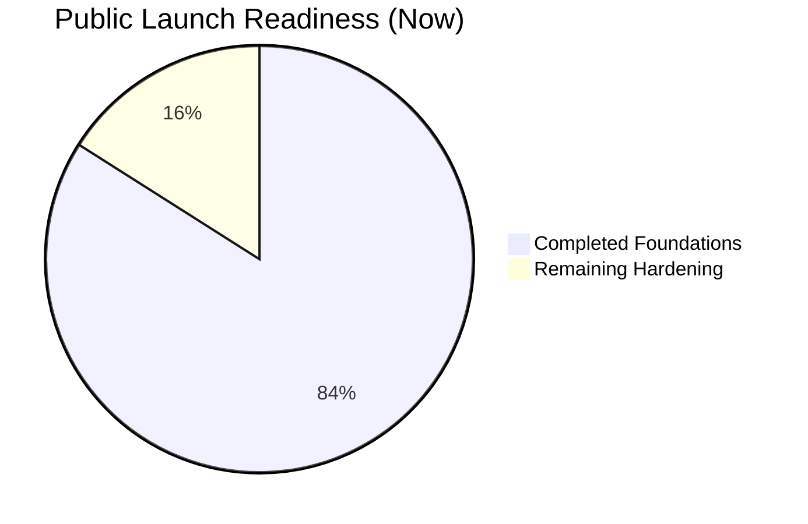
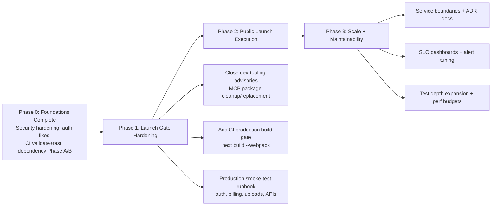

# SoloSuccess AI - Visual Public Launch Roadmap

Last updated: 2026-03-28  
Primary source of truth: `docs/reports/PRODUCTION_REMEDIATION_TRACKER.md`

---

## 1) Current Progress Snapshot

### Overall status
- **Readiness score:** **84/100**
- **Runtime security:**  
  - Root app: **4 low** advisories (`@stackframe/stack` -> `elliptic`)  
  - `server/`: **0 vulnerabilities**  
  - `railway-deploy/`: **0 vulnerabilities**
- **Quality gates:** `npm run lint` and `npm run type-check` passing
- **CI gap still open:** no mandatory remote `next build` gate yet

### Visual progress meter



---

## 2) Visual Roadmap (Progress -> Launch -> Scale)



---

## 3) Workstream Board (What is done, active, next)

```mermaid
flowchart TB
    subgraph DONE[Done]
      D1[Critical API/Auth hardening]
      D2[Dependency Phase A<br/>server + railway-deploy]
      D3[Dependency Phase B<br/>root same-major safe upgrades]
      D4[Lint + type-check clean]
    end

    subgraph ACTIVE[Active / Immediate Next]
      A1[Tracker + audit docs synchronized]
      A2[Prepare launch gate checklist execution]
    end

    subgraph NEXT[Next Up (Pre-Launch)]
      N1[Remove/replace deprecated MCP dev packages]
      N2[Add required CI production build job]
      N3[Run production smoke-test suite on preview/prod]
    end

    subgraph LATER[After Public Launch]
      L1[Performance budgets and regression alerts]
      L2[Architecture boundaries + maintainability refactor]
      L3[Scale capacity + cost optimization]
    end
```

---

## 4) Implementation + Enhancement Plan

## Phase 1 - Launch Gate Hardening (must-pass before broad public launch)

### Objectives
1. Remove unresolved **dev-tooling high advisories** (deprecated MCP package chain).
2. Add **remote production build** to CI gate.
3. Run **end-to-end production smoke test** and capture evidence.

### Deliverables
- `docs/reports/PRODUCTION_REMEDIATION_TRACKER.md` updated with final gate evidence.
- CI workflow includes `next build --webpack` (or equivalent production build command).
- "Launch Readiness Report" artifact with pass/fail table for critical flows:
  - Signup/login/logout
  - Billing checkout/portal/cancel/reactivate
  - AI generation paths
  - File upload/download/delete
  - Health endpoints and key dashboard APIs

### Exit criteria (Definition of Done)
- `npm audit --omit=dev` remains **0 high/critical** across runtime packages.
- Full CI gate green (validate + tests + production build).
- No Sev-1/Sev-2 issues in smoke test.

---

## Phase 2 - Public Launch Execution

### Objectives
1. Ship with predictable reliability and clear support playbooks.
2. Ensure observability and incident response are operational on day 1.
3. Keep documentation founder-friendly and current.

### Deliverables
- Incident response runbook (detection, escalation, rollback).
- Dashboard for core launch KPIs:
  - Activation rate
  - Error rate
  - API latency
  - Payment success rate
- Founder operations checklist (daily launch checks + escalation contacts).

### Exit criteria
- Launch day checklist completed with verified links and owners.
- Monitoring + alerting tested with one dry-run incident.
- Documentation points to one authoritative tracker (no conflicting status docs).

---

## Phase 3 - Scale and Maintainability

### Objectives
1. Keep code easy to change safely.
2. Reduce long-term maintenance drag.
3. Support traffic growth without reliability regressions.

### Deliverables
- Architecture boundaries and ADRs for high-change domains (`billing`, `ai`, `integrations`, `notifications`).
- Performance regression guardrails (budgets + alert thresholds).
- Test strategy hardening:
  - Contract tests for critical APIs
  - Focused integration tests for billing/auth/upload flows
- Cost/performance watchlist (DB hotspots, expensive AI routes, queue throughput).

### Exit criteria
- No high-risk "knowledge silo" modules without owner/docs.
- Performance and reliability dashboards stable across two release cycles.
- Mean time to recovery (MTTR) trend improving.

---

## 5) Prioritized Next Actions (Smallest Safe Sequence)

| Priority | Task | Why it matters | Risk if delayed |
|---|---|---|---|
| P0 | Replace/remove deprecated MCP dev packages | Clears unresolved high dev advisories and deprecation debt | Toolchain/security debt grows |
| P0 | Add production build in CI | Prevents shipping compile/build regressions | Broken deploy risk |
| P0 | Run launch smoke-test on preview/prod | Proves real user-critical flows | Public launch incident risk |
| P1 | Create incident runbook + escalation matrix | Faster recovery under pressure | Longer outages |
| P1 | Add launch KPI dashboard | Faster decision-making during launch window | Blind spots |
| P2 | Architecture boundary cleanup + ADRs | Better maintainability at scale | Slower feature delivery |

---

## 6) Public Launch Readiness Gate (single checklist)

- [ ] Runtime audit clean of high/critical advisories  
- [ ] CI includes and passes production build  
- [ ] Critical flow smoke tests pass in preview/prod  
- [ ] Monitoring and alerting verified with dry run  
- [ ] Incident and rollback runbooks complete  
- [ ] Tracker and launch docs synchronized and current

When all six are checked, SoloSuccess AI is in **high-quality public-launch-ready state** with a clear path to maintainability and scale.
