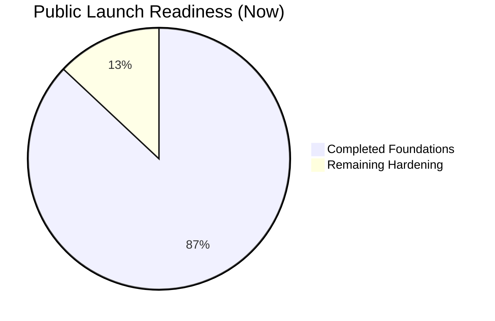

# SoloSuccess AI - Visual Public Launch Roadmap

Last updated: 2026-04-06  
Primary source of truth: `docs/reports/PRODUCTION_REMEDIATION_TRACKER.md`  
Launch smoke procedure: `docs/reports/LAUNCH_SMOKE_TEST_RUNBOOK.md`  
Incident / rollback: `docs/deployment/INCIDENT_AND_ROLLBACK_RUNBOOK.md`  
Monitoring dry run: `docs/deployment/MONITORING_VERIFICATION.md`

---

## 1) Current Progress Snapshot

### Overall status
- **Readiness score:** **87/100** (aligned with `PRODUCTION_REMEDIATION_TRACKER.md` baseline)
- **Runtime security:**  
  - Root app: **4 low** advisories (`@stackframe/stack` -> `elliptic`)  
  - `server/`: **0 vulnerabilities**  
  - `railway-deploy/`: **0 vulnerabilities**
- **Quality gates:** `npm run lint` and `npm run type-check` passing
- **CI gate:** remote production build is now configured to run on PRs/pushes to `main`

### Visual progress meter



---

## 2) Visual Roadmap (Progress -> Launch -> Scale)


---

## 3) Workstream Board (What is done, active, next)

```mermaid
flowchart TB
    subgraph DONE[Done]
      D1[Critical API/Auth hardening]
      D2[Dependency Phase A<br/>server + railway-deploy]
      D3[Dependency Phase B<br/>root same-major safe upgrades]
      D4[Lint + type-check clean]
    end

    subgraph ACTIVE[Active / Immediate Next]
      A1[Tracker + audit docs synchronized]
      A2[Prepare launch gate checklist execution]
    end

    subgraph NEXT[Next Up (Pre-Launch)]
      N1[Investigate/resolve remaining next-pwa dev advisories]
      N2[CI production build gate enabled on PR + push]
      N3[Run production smoke-test suite on preview/prod]
    end

    subgraph LATER[After Public Launch]
      L1[Performance budgets and regression alerts]
      L2[Architecture boundaries + maintainability refactor]
      L3[Scale capacity + cost optimization]
    end
```

---

## 4) Implementation + Enhancement Plan

## Phase 1 - Launch Gate Hardening (must-pass before broad public launch)

### Objectives
1. Resolve remaining **dev-only next-pwa advisory chain** with smallest-safe path.
2. Keep **remote production build** gate enforced in CI.
3. Run **end-to-end production smoke test** and capture evidence.

### Deliverables
- `docs/reports/PRODUCTION_REMEDIATION_TRACKER.md` updated with final gate evidence.
- CI workflow includes `next build --webpack` (or equivalent production build command).
- "Launch Readiness Report" artifact with pass/fail table for critical flows:
  - Signup/login/logout
  - Billing checkout/portal/cancel/reactivate
  - AI generation paths
  - File upload/download/delete
  - Health endpoints and key dashboard APIs

### Exit criteria (Definition of Done)
- `npm audit --omit=dev` remains **0 high/critical** across runtime packages.
- Full CI gate green (validate + tests + production build on PR/push to `main`).
- No Sev-1/Sev-2 issues in smoke test.

---

## Phase 2 - Public Launch Execution

### Objectives
1. Ship with predictable reliability and clear support playbooks.
2. Ensure observability and incident response are operational on day 1.
3. Keep documentation founder-friendly and current.

### Deliverables
- Incident response runbook (detection, escalation, rollback).
- Dashboard for core launch KPIs:
  - Activation rate
  - Error rate
  - API latency
  - Payment success rate
- Founder operations checklist (daily launch checks + escalation contacts).

### Exit criteria
- Launch day checklist completed with verified links and owners.
- Monitoring + alerting tested with one dry-run incident.
- Documentation points to one authoritative tracker (no conflicting status docs).

---

## Phase 3 - Scale and Maintainability

### Objectives
1. Keep code easy to change safely.
2. Reduce long-term maintenance drag.
3. Support traffic growth without reliability regressions.

### Deliverables
- Architecture boundaries and ADRs for high-change domains (`billing`, `ai`, `integrations`, `notifications`).
- Performance regression guardrails (budgets + alert thresholds).
- Test strategy hardening:
  - Contract tests for critical APIs
  - Focused integration tests for billing/auth/upload flows
- Cost/performance watchlist (DB hotspots, expensive AI routes, queue throughput).

### Exit criteria
- No high-risk "knowledge silo" modules without owner/docs.
- Performance and reliability dashboards stable across two release cycles.
- Mean time to recovery (MTTR) trend improving.

---

## 5) Prioritized Next Actions (Smallest Safe Sequence)

| Priority | Task | Why it matters | Risk if delayed |
|---|---|---|---|
| P0 | Resolve `@ducanh2912/next-pwa` dev advisory chain with smallest-safe approach | Reduces remaining high findings in full dev audit | Persistent security noise and upgrade uncertainty |
| P0 | Keep production build in CI (PR + push) and monitor failures | Prevents shipping compile/build regressions | Broken deploy risk |
| P0 | Run launch smoke-test on preview/prod | Proves real user-critical flows | Public launch incident risk |
| P1 | Incident runbook + escalation matrix — **done** (`docs/deployment/INCIDENT_AND_ROLLBACK_RUNBOOK.md`) | Faster recovery under pressure | Longer outages |
| P1 | Add launch KPI dashboard | Faster decision-making during launch window | Blind spots |
| P2 | Architecture boundary cleanup + ADRs | Better maintainability at scale | Slower feature delivery |

---

## 6) Public Launch Readiness Gate

### Repo and automation (no live URL required)

- [x] **Runtime audit:** no **high/critical** in **`npm audit --omit=dev`** for the root app; residual **low** (`elliptic` / `@stackframe/stack`) tracked upstream — see tracker baseline  
- [x] **CI production build:** `.github/workflows/ci.yml` runs **`next build --webpack`** on **PR + push** to **`main`** (plus schedule / manual)  
- [x] **Incident + rollback runbook:** `docs/deployment/INCIDENT_AND_ROLLBACK_RUNBOOK.md`  
- [x] **Monitoring dry-run procedure:** `docs/deployment/MONITORING_VERIFICATION.md`  
- [x] **Smoke test procedure + script:** `docs/reports/LAUNCH_SMOKE_TEST_RUNBOOK.md` and **`npm run smoke`**  
- [x] **Tracker and launch docs synchronized** for 2026-04-06 (this file + `PRODUCTION_REMEDIATION_TRACKER.md`)

### Your verification (run once on real preview/production)

- [ ] **Critical flow smoke tests** — follow `LAUNCH_SMOKE_TEST_RUNBOOK.md`, fill the evidence table, attach date/URL  
- [ ] **Monitoring dry run** — follow `MONITORING_VERIFICATION.md`, fill the evidence table, then you can treat alerting as “verified”

When both verification boxes are checked **and** the repo items above stay true, SoloSuccess AI is in **high-quality public-launch-ready state** for go-live.
