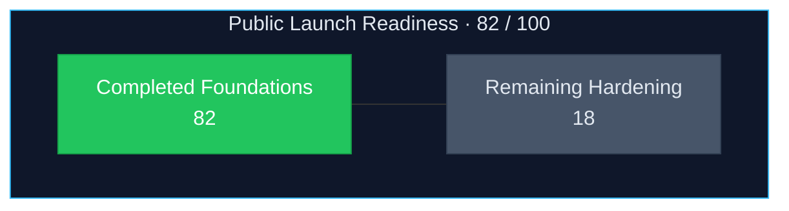
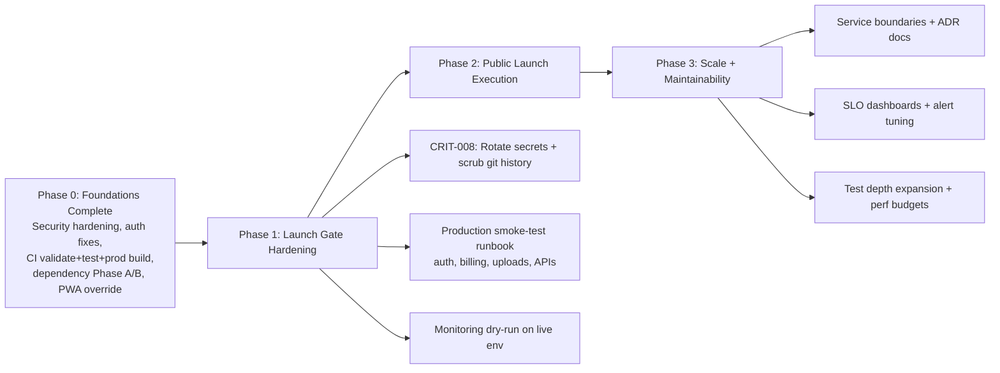
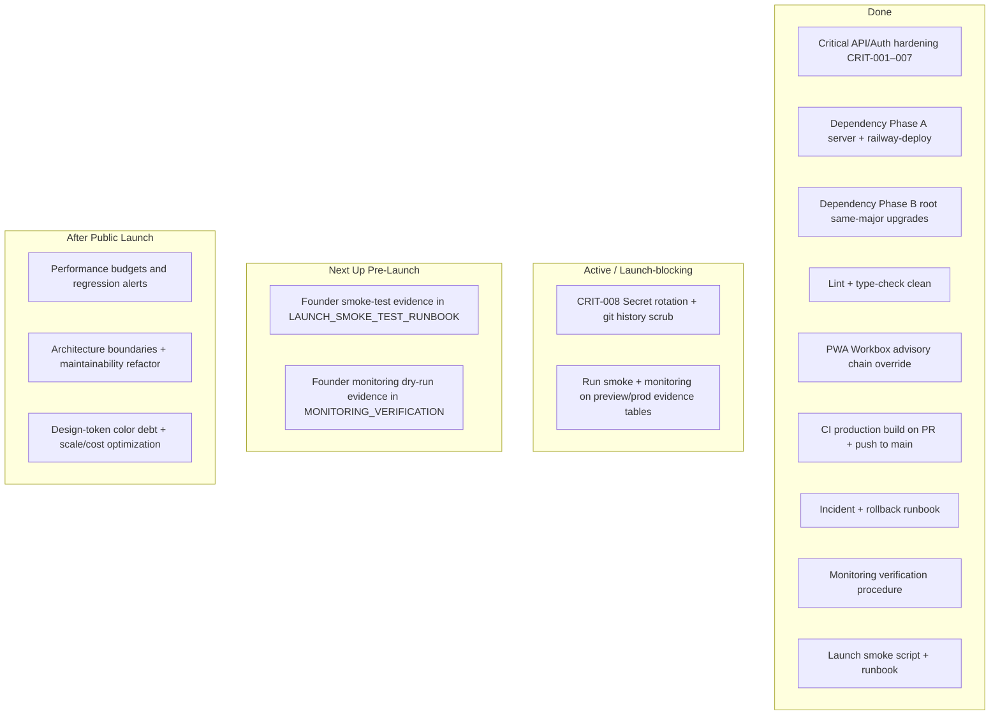

# SoloSuccess AI - Visual Public Launch Roadmap

**Last updated:** 2026-05-20  
**Primary source of truth:** [PRODUCTION_REMEDIATION_TRACKER.md](./PRODUCTION_REMEDIATION_TRACKER.md)  
**Launch smoke procedure:** [LAUNCH_SMOKE_TEST_RUNBOOK.md](./LAUNCH_SMOKE_TEST_RUNBOOK.md)  
**Incident / rollback:** [docs/deployment/INCIDENT_AND_ROLLBACK_RUNBOOK.md](../deployment/INCIDENT_AND_ROLLBACK_RUNBOOK.md)  
**Monitoring dry run:** [docs/deployment/MONITORING_VERIFICATION.md](../deployment/MONITORING_VERIFICATION.md)  
**Secret rotation (launch-blocking):** [SECRET_ROTATION_RUNBOOK.md](./SECRET_ROTATION_RUNBOOK.md) · **Step-by-step finish:** [CRIT-008_FINISH_CHECKLIST.md](./CRIT-008_FINISH_CHECKLIST.md)

---

## 1) Current Progress Snapshot

### Overall status

- **Readiness score:** **82/100** (aligned with `PRODUCTION_REMEDIATION_TRACKER.md`; was 87 until **CRIT-008** opened)
- **Launch blocker:** **CRIT-008** — **partially remediated** (~2026-04-27–05-17): DB, auth, Stripe, OpenAI, Anthropic, Upstash largely rotated; **still open:** Zoho SMTP env + verify, Twitter/Stack/VAPID/reCAPTCHA/Brave/Context7, smoke verifications, **git history scrub** ([SECRET_ROTATION_RUNBOOK.md](./SECRET_ROTATION_RUNBOOK.md))
- **Runtime security (root app, `npm audit --omit=dev`):** **0 critical / 0 high**; residual **low** (`@stackframe/stack` → `elliptic`) and some **moderate** transitive advisories (e.g. `brace-expansion`); `server/` and `railway-deploy/`: **0 vulnerabilities**
- **Quality gates:** `npm run validate` passing (verified **2026-05-20**)
- **CI gate:** `.github/workflows/ci.yml` runs **validate + tests + `next build --webpack`** on PRs and pushes to `main`
- **PWA dev advisory chain:** resolved (2026-03-29 `serialize-javascript` override — no longer a Phase 1 objective)

### Visual progress meter

> **Note:** The “18” slice includes the **−5 CRIT-008** deduction plus ongoing operator verification (smoke + monitoring) and non-blocking polish tracked in [PROJECT_TRACKER.md](../../PROJECT_TRACKER.md).

---

## 2) Visual Roadmap (Progress → Launch → Scale)

---

## 3) Workstream Board (What is done, active, next)

---

## 4) Implementation + Enhancement Plan

### Phase 1 — Launch Gate Hardening (must-pass before broad public launch)

#### Objectives

1. **Complete CRIT-008** — rotate compromised credentials and scrub `.env.production` from git history ([SECRET_ROTATION_RUNBOOK.md](./SECRET_ROTATION_RUNBOOK.md)).
2. Run **end-to-end production smoke test** on preview/production and capture evidence.
3. Complete **monitoring dry run** on live infrastructure.

#### Deliverables

- `PRODUCTION_REMEDIATION_TRACKER.md` updated with CRIT-008 **DONE** and post-rotation verification.
- Launch Readiness evidence (pass/fail) for critical flows:
  - Signup / login / logout
  - Billing checkout / portal / cancel / reactivate
  - AI generation paths
  - File upload / download / delete
  - Health endpoints and key dashboard APIs

#### Exit criteria (Definition of Done)

- CRIT-008 **DONE** (all secrets rotated; history scrubbed or repo treated as compromised).
- `npm audit --omit=dev` remains **0 high/critical** on runtime trees.
- Full CI green on `main` (validate + tests + production build).
- No Sev-1/Sev-2 issues in smoke test.

---

### Phase 2 — Public Launch Execution

#### Objectives

1. Ship with predictable reliability and clear support playbooks.
2. Ensure observability and incident response are operational on day 1.
3. Keep documentation founder-friendly and current.

#### Deliverables

- Incident response runbook (detection, escalation, rollback) — **done** (`docs/deployment/INCIDENT_AND_ROLLBACK_RUNBOOK.md`).
- Dashboard for core launch KPIs (activation, error rate, API latency, payment success).
- Founder operations checklist (daily launch checks + escalation contacts).

#### Exit criteria

- Launch day checklist completed with verified links and owners.
- Monitoring + alerting tested with one dry-run incident.
- Single authoritative tracker (this roadmap + production tracker + `PROJECT_TRACKER.md` stay aligned).

---

### Phase 3 — Scale and Maintainability

#### Objectives

1. Keep code easy to change safely.
2. Reduce long-term maintenance drag.
3. Support traffic growth without reliability regressions.

#### Deliverables

- Architecture boundaries and ADRs for high-change domains (`billing`, `ai`, `integrations`, `notifications`).
- Performance regression guardrails (budgets + alert thresholds).
- Test strategy hardening (contract tests; billing/auth/upload integration tests).
- Cost/performance watchlist (DB hotspots, expensive AI routes, queue throughput).

#### Exit criteria

- No high-risk “knowledge silo” modules without owner/docs.
- Performance and reliability dashboards stable across two release cycles.
- Mean time to recovery (MTTR) trend improving.

---

## 5) Prioritized Next Actions (Smallest Safe Sequence)

| Priority | Task | Why it matters | Risk if delayed |
| --- | --- | --- | --- |
| **P0** | Complete **CRIT-008** secret rotation + git history scrub | Credentials may be recoverable from git history | Account takeover, billing fraud, data breach |
| **P0** | Run launch smoke-test on preview/prod + fill evidence table | Proves real user-critical flows | Public launch incident risk |
| **P0** | Monitoring dry run on live env | Confirms alerts and dashboards work | Blind outages |
| **P1** | Incident runbook + escalation matrix — **done** (`INCIDENT_AND_ROLLBACK_RUNBOOK.md`) | Faster recovery under pressure | Longer outages |
| **P1** | Launch KPI dashboard | Faster decisions during launch window | Blind spots |
| **P2** | Architecture boundary cleanup + ADRs | Maintainability at scale | Slower feature delivery |
| **P2** | Design-token color refactor (`PROJECT_TRACKER.md`) | Consistent brand + easier theming | Visual drift, refactor cost later |

---

## 6) Public Launch Readiness Gate

### Repo and automation (no live URL required)

- [x] **Runtime audit:** no **high/critical** in **`npm audit --omit=dev`** for the root app; residual **low/moderate** tracked — see production tracker baseline
- [x] **CI production build:** `.github/workflows/ci.yml` runs **`next build --webpack`** on **PR + push** to **`main`** (plus schedule / manual)
- [x] **Incident + rollback runbook:** `docs/deployment/INCIDENT_AND_ROLLBACK_RUNBOOK.md`
- [x] **Monitoring dry-run procedure:** `docs/deployment/MONITORING_VERIFICATION.md`
- [x] **Smoke test procedure + script:** `LAUNCH_SMOKE_TEST_RUNBOOK.md` and **`npm run smoke`**
- [x] **PWA / Workbox dev advisory chain:** resolved via `serialize-javascript` override (2026-03-29)
- [ ] **CRIT-008 secret rotation:** [SECRET_ROTATION_RUNBOOK.md](./SECRET_ROTATION_RUNBOOK.md) — **launch-blocking**
- [x] **Tracker and launch docs synchronized** for **2026-05-20** (this file, `PRODUCTION_REMEDIATION_TRACKER.md`, `PROJECT_TRACKER.md`)

### Your verification (run once on real preview/production)

- [ ] **Critical flow smoke tests** — follow `LAUNCH_SMOKE_TEST_RUNBOOK.md`, fill the evidence table, attach date/URL
- [ ] **Monitoring dry run** — follow `MONITORING_VERIFICATION.md`, fill the evidence table, then treat alerting as verified

When **CRIT-008** is complete, both verification boxes are checked, and the repo items above stay true, SoloSuccess AI is in **high-quality public-launch-ready state** for go-live.
